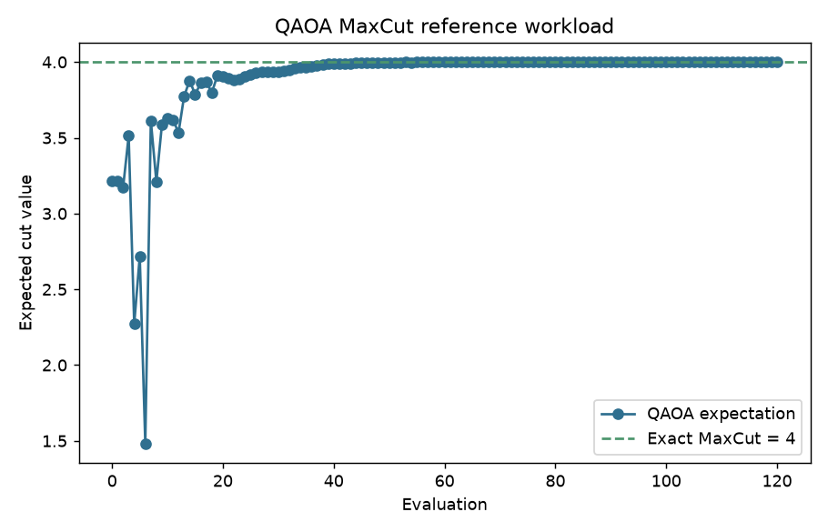

# Quantum Dev Workspace

[Traditional Chinese](README.zh-TW.md)

A reproducible quantum software workspace for developing and comparing quantum algorithms across local simulators, GPU-accelerated simulators, CUDA-Q, and IBM Quantum Runtime.

The repository focuses on three complementary tracks:

- **Algorithm track:** an H2 variational quantum eigensolver (VQE) implemented with Qiskit, PennyLane, and CUDA-Q, using a shared Hamiltonian and ansatz definition.
- **Workload abstraction track:** a small expectation-value primitive that can host multiple NISQ workloads. H2 VQE and QAOA MaxCut are provided as reference workloads.
- **Backend track:** a hardware-efficient ansatz (HEA) benchmark that evaluates the same circuit across CPU simulation, naive GPU simulation, CUDA-Q/cuStateVec acceleration, and IBM Quantum as a real-QPU execution target.

The intent is not to claim practical quantum advantage. The project documents a backend-agnostic development workflow: validate locally, compare simulator implementations, use GPU acceleration where appropriate, and submit selected circuits to real quantum hardware for noisy execution behavior.

## Highlights

| Area | Evidence |
|---|---|
| Cross-framework VQE | Qiskit, PennyLane, and CUDA-Q converge on the same H2 ground-state reference, `-1.857275 Ha`. |
| Generic expectation workload | QAOA MaxCut runs through the same expectation primitive and reaches the exact cut value `4.000000` on a 4-node square graph at `p=2`. |
| Real-hardware execution | IBM Quantum Runtime was used for both a fixed-parameter Estimator check and a small hardware-in-the-loop VQE trajectory on `ibm_kingston`, a 156-qubit IBM backend. |
| Simulator scaling | CPU statevector experiments show the exponential cost of increasing qubit count. |
| Backend benchmark | At `n=24`, `depth=3`, CUDA-Q/cuStateVec completed one expectation evaluation in `0.19 s`, compared with `72.8 s` on CPU simulation in this local measurement. |
| Adaptive routing | A resource-aware router estimates runtime/memory from benchmark CSV files and recommends CPU, CUDA-Q, or IBM execution semantics based on budgets and accuracy mode. |

## Environment Self-Check

After cloning the repository, run the local environment profiler first. It records the Python stack, available GPU tooling, WSL status, and small CPU/CUDA-Q smoke benchmarks.

```powershell
python quantum_vqe/quantum_env_check.py --max-qubits 12 --depth 1
```

The profiler writes:

- `quantum_vqe/outputs/env_profile.json` for machine-readable local capability data.
- `quantum_vqe/outputs/env_profile.md` for a human-readable environment report.

Cloud/QPU state is checked separately:

```powershell
python quantum_vqe/quantum_cloud_check.py --backend ibm_kingston
```

This writes `quantum_vqe/outputs/cloud_profile.json` and `quantum_vqe/outputs/cloud_profile.md`, including IBM account availability, usage data when exposed by the Runtime client, backend operational status, and queue depth. Account identifiers and tokens are not written.

The router reads both profiles by default. This makes routing local- and account-aware: CPU/GPU availability comes from `env_profile.json`, while IBM eligibility comes from `cloud_profile.json`.

## Workload Scope

The current engine scope is expectation-based NISQ workloads. The execution primitive is:

```text
circuit(params) + observable -> expectation value
```

| Workload class | Examples | Current engine fit | Required extension |
|---|---|---|---|
| Expectation-based variational workloads | VQE, QAOA, VQC/QML, Hamiltonian simulation observables | Native fit | Provide workload-specific circuit, observable, parameters, and objective adapter. |
| Shot-based sampling workloads | Grover-style demos, random circuit sampling, kernel estimation | Small extension | Add a sampling primitive that returns counts or probability distributions. |
| QFT / phase-estimation workloads | QFT demos, amplitude estimation, phase estimation, Shor-style educational circuits | Medium extension | Add QFT/controlled-unitary builders and sampling-based post-processing. |
| Dynamic-circuit workloads | Mid-circuit measurement, feed-forward circuits, selected error-correction demos | Larger extension | Add backend capability checks and executor support for conditional operations. |
| Hardware-constrained workloads | Layout-sensitive circuits, deep entangling circuits, topology-aware experiments | Backend-policy extension | Add coupling-map awareness, transpilation constraints, and hardware-specific validation. |

This repository does not claim universal quantum algorithm support. The current implementation targets expectation workloads while keeping the router and profiling layers extensible for sampling and dynamic-circuit primitives.

## Quick Start

Windows local environment:

```powershell
python -m venv .venv
.\.venv\Scripts\Activate.ps1
pip install -r requirements.txt

python demo.py
```

The demo runs Qiskit and PennyLane VQE, then generates the convergence comparison plot.

GPU and CUDA-Q workflows require WSL2, Linux, or Docker. See [docs/CUDA-Q_SETUP.md](docs/CUDA-Q_SETUP.md).

## H2 VQE

The VQE implementation uses a shared 2-qubit H2 Hamiltonian, a shared 4-parameter ansatz, and COBYLA optimization. The framework-specific code changes the execution engine while preserving the problem definition.

| Engine | Environment | Result | Notes |
|---|---|---:|---|
| Exact diagonalization | local CPU | `-1.857275 Ha` | Reference value |
| Qiskit | local CPU | `-1.857275 Ha` | VQE convergence, error about `1e-13 Ha` |
| PennyLane | local CPU | `-1.857275 Ha` | VQE convergence, error about `1e-13 Ha` |
| CUDA-Q | WSL2 + NVIDIA RTX 2060 | `-1.857275 Ha` | GPU target, error about `2e-7 Ha` |


## QAOA MaxCut

QAOA is included as a second reference workload to demonstrate that the execution layer is not specific to molecular VQE. The workload provides a QAOA circuit, a MaxCut cost observable, trainable parameters, and a maximize objective.

```powershell
python quantum_vqe/run_qaoa_maxcut.py --graph square --p 2 --maxiter 120
```

Recorded local result:

| Graph | QAOA depth | Exact MaxCut | Best expected cut | Approximation ratio |
|---|---:|---:|---:|---:|
| 4-node square | `p=2` | `4` | `4.000000` | `1.000000` |



### IBM Quantum Fixed-Parameter Check

The IBM result is a single Estimator evaluation using the same H2 ansatz, observable, and parameter vector `[0.1, 0.1, 0.05, 0.05]`.

| Source | Energy / Expectation |
|---|---:|
| Local ideal statevector, same parameters | `-1.047914 Ha` |
| IBM Quantum `ibm_kingston`, same parameters | `-1.088185 Ha` |
| Difference | about `0.04 Ha` |

This difference should be interpreted as real-hardware behavior under noise, shot statistics, transpilation/layout choices, and the absence of error mitigation. It is not a comparison against the optimized VQE ground-state energy.

See [docs/IBM_CLOUD_AUDIT.md](docs/IBM_CLOUD_AUDIT.md) for the recorded job context.

### IBM Hardware-in-the-Loop VQE

To distinguish a single Estimator call from a real VQE loop, the repository also includes a small hardware-in-the-loop VQE run:

```text
local COBYLA optimizer -> IBM Runtime Estimator energy(theta) -> parameter update
```

This run completed 10 hardware energy evaluations on `ibm_kingston`. Evaluation 11 remained queued and was cancelled after the completed trajectory had already demonstrated optimizer progress.

| Metric | Value |
|---|---:|
| Initial IBM evaluation | `-1.056036 Ha` |
| Best observed IBM evaluation | `-1.526744 Ha` |
| Completed hardware evaluations | `10` |
| Best evaluation index | `8` |


The result should be interpreted as a small noisy-hardware VQE trajectory, not as a fully converged chemistry result. Runtime is dominated by sequential QPU queue and job latency.

## Exponential Scaling Experiment

The scaling experiment evaluates larger HEA circuits on a CPU simulator to show how statevector simulation cost increases with qubit count.

| Qubits | Time per evaluation | Approximate statevector size |
|---:|---:|---:|
| 16 | `0.33 s` | `2 MB` |
| 20 | `5.8 s` | `32 MB` |
| 22 | `19.9 s` | `128 MB` |
| 24 | `26.6 s` at depth 1 | `512 MB` |
| about 30 | extrapolated minutes | `16 GB` |


The result motivates practical alternatives such as GPU acceleration, specialized simulators, tensor-network or approximate methods where applicable, distributed computation, and real QPU execution for hardware behavior.

## Quantum Stack Benchmark

The stack benchmark uses the same hardware-efficient ansatz:

```text
RY/RZ on all qubits -> CNOT chain -> measure <Z0>
```

It compares the cost and numerical consistency of the same expectation-value computation across execution layers.

| Layer | Backend | Role |
|---|---|---|
| L1 | Qiskit CPU statevector | Correctness baseline |
| L2 | CuPy naive GPU statevector | Educational GPU baseline, not a production simulator |
| L3 | CUDA-Q `nvidia` target / cuStateVec | GPU-accelerated quantum simulation backend |
| L4 | IBM Quantum QPU | Real-hardware semantic comparison, not runtime comparison |

Measurement controls:

- `--verify-target` records the actual device and backend target.
- GPU timings include explicit synchronization to avoid undercounting asynchronous kernels.
- Warmup runs are excluded; reported values use the median of repeated measurements.
- Results are written as CSV with `backend, device, target, precision, qubits, depth, runtime_s, expectation`.
- Qiskit Pauli endianness is handled so CPU, naive GPU, and CUDA-Q measure the same qubit-0 observable.

Measured on WSL2 + NVIDIA RTX 2060:

| Depth | CPU | naive GPU | CUDA-Q/cuStateVec | CPU / CUDA-Q |
|---:|---:|---:|---:|---:|
| 1 | `35.3 s` | `1.47 s` | `0.13 s` | about `265x` |
| 3 | `72.8 s` | `4.36 s` | `0.19 s` | about `389x` |


Numerical cross-check across 12 shared points:

| Comparison | Maximum `<Z0>` difference |
|---|---:|
| CPU vs naive GPU | `4.6e-14` |
| CPU vs CUDA-Q | `3.8e-7` |

IBM Quantum is treated separately because queue time and noisy QPU execution are not directly comparable to simulator runtime.

## Resource-Aware Router

The repository includes a small adaptive execution router for variational workflows. It reads the benchmark CSV files, fits simple runtime models, estimates statevector memory, and recommends an execution backend under explicit constraints.

```powershell
python quantum_vqe/quantum_router.py --qubits 8 --depth 1 --accuracy exact --time-budget 1
python quantum_vqe/quantum_router.py --qubits 24 --depth 3 --accuracy exact --time-budget 10
python quantum_vqe/quantum_router.py --qubits 32 --depth 3 --accuracy hardware --allow-ibm
```

By default, the router also reads `quantum_vqe/outputs/env_profile.json` and `quantum_vqe/outputs/cloud_profile.json`. Local profile data controls CPU/GPU availability and memory budgets; cloud profile data gates IBM availability, usage-limit status, and backend operational status.

The router distinguishes three modes:

| Mode | Behavior |
|---|---|
| `exact` | Selects only noiseless local simulators such as CPU or CUDA-Q. |
| `estimate` | Selects the fastest feasible local backend and may recommend IBM only when explicitly allowed. |
| `hardware` | Selects IBM only when real-QPU semantics are requested and `--allow-ibm` is provided. |

This is a prototype resource-aware execution policy, not a universal quantum scheduler. IBM is intentionally gated because QPU results are noisy and queue-limited.

## Reproducing Results

Local CPU workflows:

```powershell
python demo.py
python quantum_vqe/run_qaoa_maxcut.py --graph square --p 2 --maxiter 120
python quantum_vqe/scale_experiment.py
python quantum_vqe/quantum_env_check.py --max-qubits 12 --depth 1
python quantum_vqe/quantum_cloud_check.py --backend ibm_kingston
python quantum_vqe/quantum_stack_benchmark.py --cpu --verify-target
python quantum_vqe/quantum_stack_benchmark.py --plot --depths 1,3
python quantum_vqe/quantum_router.py --qubits 24 --depth 3 --accuracy exact --time-budget 10
```

WSL2 CUDA-Q workflows:

```bash
cd /mnt/d/Elroy/Quant_DEV
python quantum_vqe/run_cudaq.py
python quantum_vqe/quantum_stack_benchmark.py --naive-gpu --cudaq --verify-target --depths 1,3 --max_qubits 24
```

IBM Quantum workflow:

```powershell
python quantum_vqe/run_ibm_cloud.py --list
python quantum_vqe/run_ibm_cloud.py --backend ibm_kingston
python quantum_vqe/run_ibm_vqe.py --backend ibm_kingston --maxiter 12
python quantum_vqe/run_ibm_vqe_batched.py --backend ibm_kingston --rounds 20 --session-max-time 2h
```

Requires `QISKIT_IBM_TOKEN` in `.env` or the environment. Do not commit real tokens.

## Project Structure

```text
Quant_DEV/
+-- README.md
+-- README.zh-TW.md
+-- requirements.txt
+-- requirements-cudaq.txt
+-- demo.py
+-- examples/
+-- quantum_vqe/
|   +-- h2_hamiltonian.py
|   +-- run_qiskit.py
|   +-- run_pennylane.py
|   +-- run_cudaq.py
|   +-- run_qaoa_maxcut.py
|   +-- run_ibm_cloud.py
|   +-- run_ibm_vqe.py
|   +-- run_ibm_vqe_batched.py
|   +-- scale_experiment.py
|   +-- quantum_env_check.py
|   +-- quantum_cloud_check.py
|   +-- quantum_stack_benchmark.py
|   +-- quantum_router.py
|   +-- plot_comparison.py
|   +-- outputs/
+-- src/quant_dev/
|   +-- workloads.py
|   +-- executors.py
|   +-- qaoa.py
|   +-- router.py
+-- docs/
```

## Frameworks

| Framework | Use |
|---|---|
| Qiskit | Circuit construction, local simulation, IBM Quantum Runtime |
| PennyLane | Differentiable quantum programming and VQE implementation |
| CUDA-Q | GPU-targeted quantum simulation and hybrid quantum-classical workflow |
| Cirq | Additional circuit and simulation examples |

## Notes and Limitations

- Local benchmark numbers are hardware- and load-dependent.
- The naive GPU simulator is intentionally simple and used only as an educational baseline.
- CUDA-Q/cuStateVec remains a classical simulation path; it is not real quantum hardware.
- IBM Quantum results reflect noisy hardware execution and should not be compared directly against local simulator runtime.
- The fixed-parameter IBM result is not a VQE convergence result.
- The IBM hardware-in-the-loop VQE trajectory is a small noisy run and should not be interpreted as a fully converged chemistry calculation.

## References

- [Qiskit Learning](https://learning.quantum.ibm.com/)
- [PennyLane Documentation](https://docs.pennylane.ai/)
- [CUDA-Q Documentation](https://docs.nvidia.com/cuda-quantum/latest/)
- [IBM Quantum Platform](https://quantum.ibm.com/)
