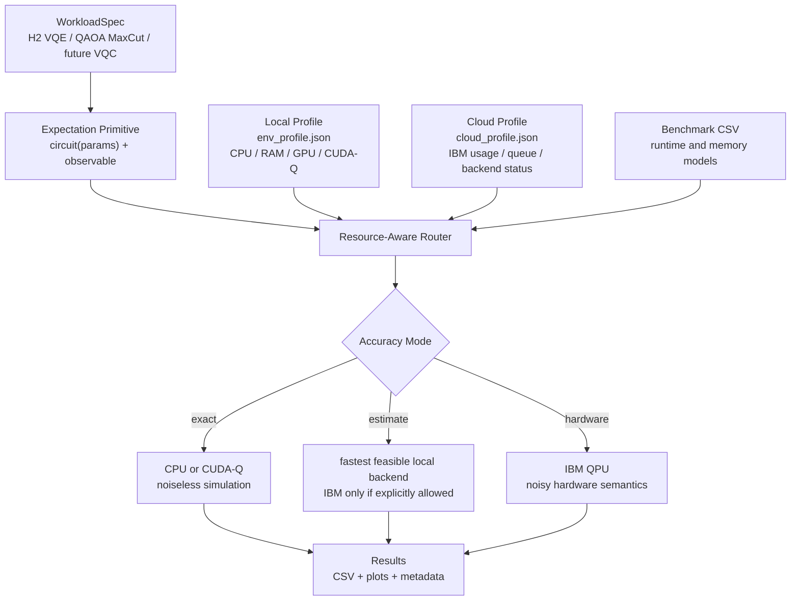

# Quantum Dev Workspace

[Traditional Chinese](README.zh-TW.md) | [Detailed technical README](docs/DETAILED_README.md)

Lightweight resource-aware quantum development platform for expectation-based NISQ workloads.

This repository profiles local and cloud execution capability, routes workloads by accuracy semantics and resource limits, and provides reference workloads across chemistry, optimization, simulator benchmarking, GPU acceleration, and IBM Quantum hardware execution.

It does not claim practical quantum advantage. The goal is a reproducible engineering workflow for deciding where a quantum workload should run: local CPU, CUDA-Q/GPU simulation, or an explicitly requested IBM QPU backend.

## What It Demonstrates

| Capability | Evidence |
|---|---|
| Generic NISQ workload layer | `ExpectationWorkload`: `circuit(params) + observable -> expectation value`. |
| Chemistry workload | H2 VQE across Qiskit, PennyLane, and CUDA-Q converges to `-1.857275 Ha`. |
| Optimization workload | QAOA MaxCut reaches exact cut value `4.000000` on a 4-node square graph at `p=2`. |
| Local/cloud profiling | `env_profile.json` captures CPU/GPU capability; `cloud_profile.json` captures IBM availability, usage, backend status, and queue depth. |
| Resource-aware routing | Router selects CPU/CUDA-Q/IBM based on exact/estimate/hardware semantics, memory, runtime budget, and QPU eligibility. |
| Backend benchmark | CPU, naive GPU, CUDA-Q/cuStateVec, and IBM QPU are compared with clear simulator-vs-hardware semantics. |

## Architecture



## Quick Start

Windows:

```powershell
python -m venv .venv
.\.venv\Scripts\Activate.ps1
pip install -r requirements.txt

python quickstart_platform.py
```

The quickstart runs a local capability check, a router smoke test, and the QAOA MaxCut reference workload. It does not submit IBM jobs by default.

Optional IBM account/backend profile:

```powershell
python quickstart_platform.py --with-cloud --backend ibm_kingston
```

GPU and CUDA-Q workflows require WSL2, Linux, or Docker. See [CUDA-Q setup](docs/CUDA-Q_SETUP.md).

## Core Commands

```powershell
python quantum_vqe/quantum_env_check.py --max-qubits 12 --depth 1
python quantum_vqe/quantum_cloud_check.py --backend ibm_kingston
python quantum_vqe/quantum_router.py --qubits 32 --depth 3 --accuracy hardware --allow-ibm
python quantum_vqe/run_qaoa_maxcut.py --graph square --p 2 --maxiter 120
python demo.py
```

## Selected Results

| Experiment | Result |
|---|---:|
| H2 exact / Qiskit / PennyLane | `-1.857275 Ha` |
| H2 CUDA-Q | `-1.857275 Ha` |
| QAOA MaxCut, square graph, `p=2` | `4.000000 / 4` |
| IBM fixed-parameter H2 Estimator on `ibm_kingston` | `-1.088185 Ha` |
| IBM hardware-in-the-loop VQE best observed value | `-1.526744 Ha` |
| CUDA-Q/cuStateVec speedup over CPU at `n=24`, `depth=3` | about `389x` in this local measurement |


## Repository Map

```text
quantum_vqe/
  run_qaoa_maxcut.py          # QAOA MaxCut reference workload
  quantum_env_check.py        # Local CPU/GPU/CUDA-Q capability profile
  quantum_cloud_check.py      # IBM account/backend capability profile
  quantum_router.py           # Resource-aware routing CLI
  quantum_stack_benchmark.py  # CPU / naive GPU / CUDA-Q / IBM benchmark
  run_qiskit.py               # H2 VQE in Qiskit
  run_pennylane.py            # H2 VQE in PennyLane
  run_cudaq.py                # H2 VQE in CUDA-Q
  run_ibm_vqe.py              # Hardware-in-the-loop IBM VQE

src/quant_dev/
  workloads.py                # Generic ExpectationWorkload
  executors.py                # Shared expectation executor
  qaoa.py                     # QAOA MaxCut workload builder
  router.py                   # Routing policy and runtime estimates
```

## Scope

Current scope: expectation-based NISQ workloads.

The platform currently supports workloads that can be expressed as:

```text
circuit(params) + observable -> expectation value
```

This directly fits VQE, QAOA, VQC/QML-style objectives, and many Hamiltonian simulation observables. Sampling workloads, QFT/phase estimation, and dynamic circuits are treated as future primitives rather than current claims.

## Documentation

- [Detailed technical README](docs/DETAILED_README.md)
- [Traditional Chinese README](README.zh-TW.md)
- [GitHub repository metadata](docs/GITHUB_METADATA.md)
- [CUDA-Q setup](docs/CUDA-Q_SETUP.md)
- [IBM cloud audit](docs/IBM_CLOUD_AUDIT.md)

## References

- [Qiskit Learning](https://learning.quantum.ibm.com/)
- [PennyLane Documentation](https://docs.pennylane.ai/)
- [CUDA-Q Documentation](https://docs.nvidia.com/cuda-quantum/latest/)
- [IBM Quantum Platform](https://quantum.ibm.com/)
