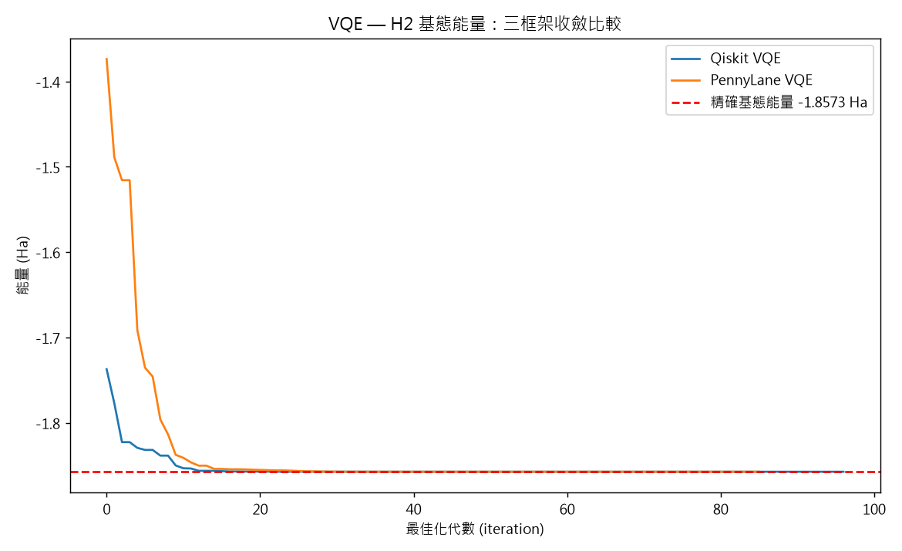
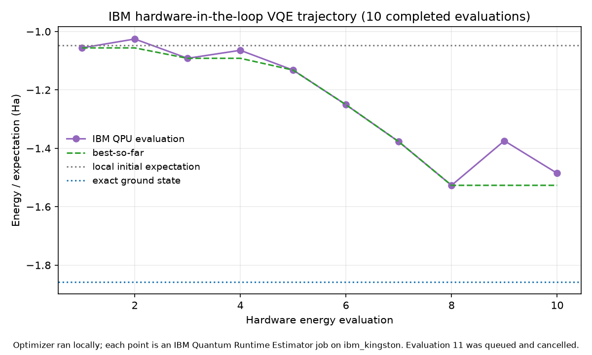
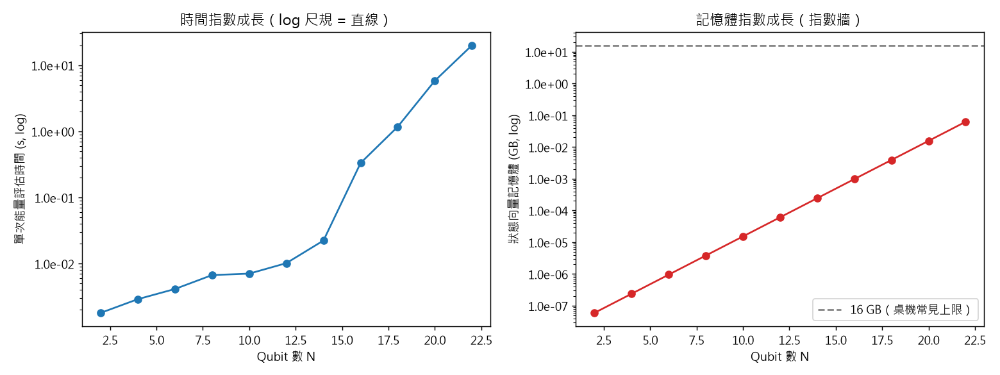
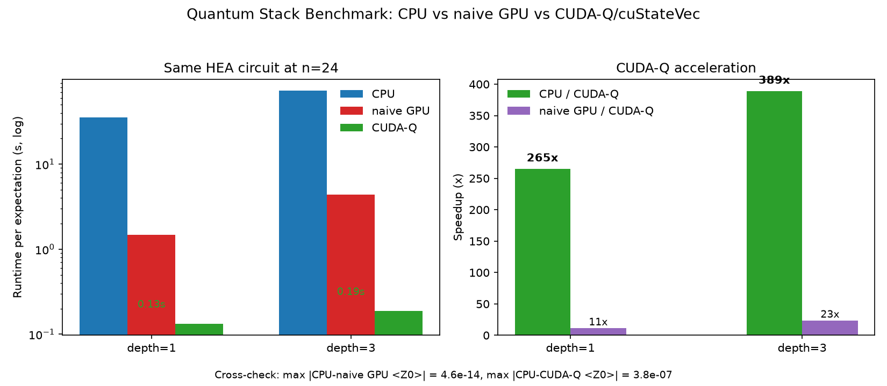
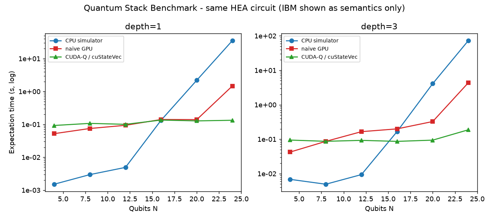

# Quantum VQE and Backend Benchmark

This directory contains the main algorithm and backend-comparison experiments for the workspace.

It has two purposes:

- Implement the same H2 VQE problem across Qiskit, PennyLane, and CUDA-Q.
- Benchmark the same hardware-efficient ansatz across CPU simulation, naive GPU simulation, CUDA-Q/cuStateVec, and IBM Quantum as a real-QPU target.

## Files

```text
quantum_vqe/
+-- h2_hamiltonian.py           # Shared H2 Hamiltonian, ansatz parameters, exact reference
+-- run_qiskit.py               # Qiskit VQE
+-- run_pennylane.py            # PennyLane VQE
+-- run_cudaq.py                # CUDA-Q VQE, requires WSL2/Linux/Docker
+-- run_ibm_cloud.py            # IBM Quantum Runtime Estimator workflow
+-- run_ibm_vqe.py              # Hardware-in-the-loop IBM VQE
+-- scale_experiment.py         # CPU scaling experiment
+-- quantum_stack_benchmark.py  # CPU / naive GPU / CUDA-Q / IBM benchmark
+-- plot_comparison.py          # VQE convergence plot
+-- wsl_test_gpu.py             # CUDA-Q GPU smoke test
+-- outputs/                    # CSV outputs and plots
```

## H2 VQE

The H2 experiment uses a shared 2-qubit Hamiltonian, a 4-parameter ansatz, and COBYLA optimization. The goal is to keep the problem definition fixed while changing the execution framework.

| Engine | Environment | Result | Notes |
|---|---|---:|---|
| Exact diagonalization | local CPU | `-1.857275 Ha` | Reference value |
| Qiskit | local CPU | `-1.857275 Ha` | Error about `1e-13 Ha` |
| PennyLane | local CPU | `-1.857275 Ha` | Error about `1e-13 Ha` |
| CUDA-Q | WSL2 + NVIDIA RTX 2060 | `-1.857275 Ha` | Error about `2e-7 Ha` |

Run on Windows:

```powershell
cd quantum_vqe
python run_qiskit.py
python run_pennylane.py
python plot_comparison.py
```

Run CUDA-Q in WSL2/Linux:

```bash
cd /mnt/d/Elroy/Quant_DEV/quantum_vqe
python run_cudaq.py
```



## IBM Quantum Runtime

The IBM workflow submits an Estimator job using the same H2 ansatz and observable at the fixed parameter vector `[0.1, 0.1, 0.05, 0.05]`.

| Source | Result |
|---|---:|
| Local ideal statevector, same parameters | `-1.047914 Ha` |
| IBM Quantum `ibm_kingston`, same parameters | `-1.088185 Ha` |
| Difference | about `0.04 Ha` |

This result is a real-hardware expectation-value evaluation. It is not a full VQE optimization performed on the QPU.

Run:

```powershell
python quantum_vqe/run_ibm_cloud.py --list
python quantum_vqe/run_ibm_cloud.py --backend ibm_kingston
```

Requires `QISKIT_IBM_TOKEN` in `.env` or the environment.

## IBM Hardware-in-the-Loop VQE

`run_ibm_vqe.py` runs the classical optimizer locally and sends each energy evaluation to IBM Runtime Estimator:

```powershell
python quantum_vqe/run_ibm_vqe.py --backend ibm_kingston --maxiter 12
```

The recorded run completed 10 hardware evaluations before evaluation 11 remained queued and was cancelled.

| Metric | Value |
|---|---:|
| Initial IBM evaluation | `-1.056036 Ha` |
| Best observed IBM evaluation | `-1.526744 Ha` |
| Completed hardware evaluations | `10` |
| Best evaluation index | `8` |



The trajectory demonstrates hardware-in-the-loop optimizer progress, but it is not a fully converged hardware chemistry calculation.

## Scaling Experiment

The scaling experiment evaluates larger HEA circuits on a CPU simulator to quantify how runtime and memory grow with qubit count.

```powershell
python quantum_vqe/scale_experiment.py
python quantum_vqe/scale_experiment.py --max_qubits 28
```



## Quantum Stack Benchmark

The stack benchmark uses the same HEA circuit on multiple execution layers:

| Layer | Backend | Role |
|---|---|---|
| L1 | Qiskit CPU statevector | Correctness baseline |
| L2 | CuPy naive GPU statevector | Educational GPU baseline |
| L3 | CUDA-Q `nvidia` target / cuStateVec | GPU-accelerated quantum simulation |
| L4 | IBM Quantum QPU | Real-hardware semantic comparison |

Run local CPU:

```powershell
python quantum_vqe/quantum_stack_benchmark.py --cpu --verify-target
```

Run GPU layers in WSL2/Linux:

```bash
python quantum_vqe/quantum_stack_benchmark.py --naive-gpu --cudaq --verify-target --depths 1,3 --max_qubits 24
```

Regenerate plots from CSV:

```powershell
python quantum_vqe/quantum_stack_benchmark.py --plot --depths 1,3
```

Measured at `n=24` on WSL2 + NVIDIA RTX 2060:

| Depth | CPU | naive GPU | CUDA-Q/cuStateVec | CPU / CUDA-Q |
|---:|---:|---:|---:|---:|
| 1 | `35.3 s` | `1.47 s` | `0.13 s` | about `265x` |
| 3 | `72.8 s` | `4.36 s` | `0.19 s` | about `389x` |





Numerical cross-check across 12 shared points:

| Comparison | Maximum `<Z0>` difference |
|---|---:|
| CPU vs naive GPU | `4.6e-14` |
| CPU vs CUDA-Q | `3.8e-7` |

## Measurement Notes

- GPU timing includes explicit synchronization.
- Warmup runs are excluded; medians are reported.
- `--verify-target` records the actual device and backend target.
- Qiskit Pauli endianness is handled so all simulator layers measure the same qubit-0 observable.
- IBM Quantum is reported as real-hardware execution semantics, not simulator runtime.
